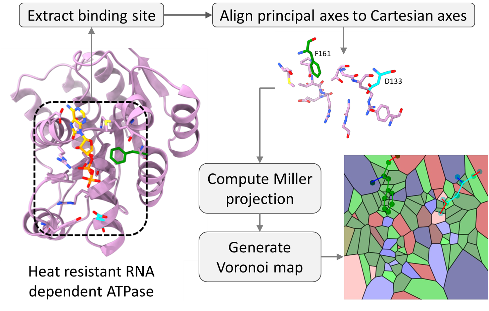

# Bionoi
Bionoi is a software that converts ligand-binding sites (3D) to Voronoi diagrams (2D) based on the 3D coordinate structure and properties of atoms/residues. Those images can be used as informative representations of ligand-binding sites for machine learning applications. The process of getting Bionoi representation of a binding site is illustrated in the following figure:  
<p align="center">
  
</p>

## Folders
* cmaps: color maps for atom type and residue type. The color map of residue type represents the hydrophobicity of each residue. This implmentation is the classic hydrophobicity implementation which is used in the BionoiNet paper. 

* dependency: envionment file exported by Anaconda.

* example_output: example Voronoi diagrams used for this document.

* legacy: codes that developed during research process, not used in final version.

* testfiles: source files to generate example images.


## Dependency
To install the dependcy Python packages, use Conda:
```
conda env create -f environment.yml
```

## Generate images for example binding site
1. Example image colored by atom type.
   ```
   python bionoi.py -colorby atom_type
   ```   
   output:   
   <p align="center">
   
   </p>
2. Example image colored by residue type (classic hydrophobicity).   
   ```
   python bionoi.py -colorby residue_type
   ```   
   output:   
   <p align="center">
   
   </p>
3. Example image colored by charge (of each atom).   
   ```
   python bionoi.py -colorby charge
   ```   
   output:   
   <p align="center">
   
   </p>
4. Example image colored by center distances (of each atom).   
   ```
   python bionoi.py -colorby center_dist
   ```
   output:   
   <p align="center">
   
   </p>
5. Example image colored by solvent accessible surface area (SASA) (of each atom).   
   ```
   python bionoi.py -colorby sasa
   ```   
   output:   
   <p align="center">
   
   </p>
6. Example image colored by hydrophobicity (of each residue).   
   ```
   python bionoi.py -colorby hydrophobicity
   ```
   output:   
   <p align="center">
   
   </p>
7. Example image colored by sequence entropy (of each residue).    
   ```
   python bionoi.py -colorby seq_entropy
   ```
   output:   
   <p align="center">
   
   </p>
8. Example image colored by binding probability (of each residue).   
   ```
   python bionoi.py -colorby binding_prob
   ```
   output:   
   <p align="center">
   
   </p>
9. Example image generated by blending the images of all the 6 properties (charge, SASA, center distance, hydrophobicity, sequence entropy and binding probability).   
   ```
   python bionoi.py -colorby blended
   ```
   output:   
   <p align="center">
   
   </p>

## Generate Images for your own dataset
To generate images for your own binding sites, you need to write a simple bash script to specify the path of .mol2 file, pop file (for sasa) and profile file (for sequence entropy) for each binding site. The ```img_gen.sh``` is a straightforward example to do that.

## Citation
If you find this work useful, please cite our papers: )   

Shi W, Lemoine JM, Shawky MA, Singha M, Pu L, Yang S, Ramanujam J, Brylinski M. (2020) BionoiNet: Ligand-binding site classification with off-the-shelf deep neural network. Bioinformatics 36 (10): 3077-3083.   

Feinstein J, Shi W, Ramanujam J, Brylinski M. Bionoi: A Voronoi Diagram-Based Representation of Ligand-Binding Sites in Proteins for Machine Learning Applications. Methods Mol Biol. 2021;2266:299-312. doi: 10.1007/978-1-0716-1209-5_17. PMID: 33759134.   

## Contributors
Wentao Shi, Jeffrey Lemoine, Joseph Feinstein, Rajiv Gandhi Govindaraj, Limeng Pu, Ye Fang, and Michal Brylinski.
